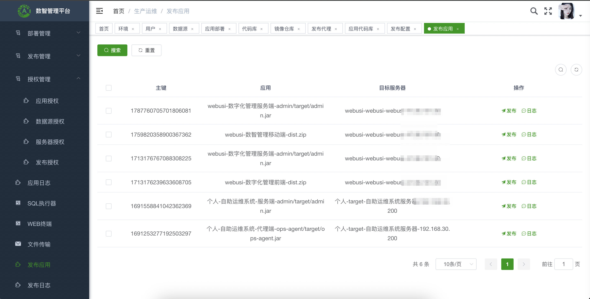

	

<h1 align="center" style="margin: 30px 0 30px; font-weight: bold;">devops v1.3.0</h1>
<h4 align="center">基于SpringBoot+Vue前后端分离的轻量级开发运维管理系统</h4>

	
	

## 平台简介

开发运维管理系统 将开发（Dev）和运维（Ops）进行有机结合，提供一整套工具，可以有效提高软件交付的效率和质量。

一个前端 + 一个后端 就覆盖开发运维系统核心能力 发布应用、访问服务器、查询日志、监控告警。  
不用安装jenkins、prometheus、jumpserver、grafana等众多开源工具。  
轻松支撑生产平稳运行。  

主要功能包括：服务器管理、授权管理、应用管理、部署管理、发布管理、WEB终端、应用发布、上传下载、数据库客户端、查询应用日志、系统监控

支持：web、jar、docker

支持： 
* 将开发运维管理系统部署至客户环境，将应用发布至客户环境、访问服务器、查看日志、执行sql。  
* 将开发运维管理系统部署至公司环境，将应用发布至客户环境、访问服务器、查看日志、执行sql。  

开源和盘古栈云解决方案

  

适配不同网络环境 

  
技术栈 
* 前端采用Vue、Element UI。
* 后端采用Spring Boot、Spring Security、Redis & Jwt。
* 权限认证使用Jwt，支持多终端认证系统。
* 支持加载动态权限菜单，多方式轻松权限控制。
* 高效率开发，使用代码生成器可以一键生成前后端代码。
* 特别鸣谢：[element](https://github.com/ElemeFE/element)，[vue-element-admin](https://github.com/PanJiaChen/vue-element-admin)，[eladmin-web](https://github.com/elunez/eladmin-web)。

## 团队产品
https://www.webusi.net

## 微信交流
<tr>
    <td></td>
</tr>

## 更新日志
### 1.3.0 2024-12-15
1.  优化：SQL执行器全新界面，更便捷
2.  优化：WEB终端全新界面，更便捷
3.  优化：文件传输全新界面，更便捷

### 1.2.0 2024-11-07
1.  优化：应用发布，支持选择环境
2.  优化：增加显示连接方式：直连、代理
3.  功能：增加系统监控：监控项、监控主机、主机监控项、监控策略、监控大屏、告警提醒

### 1.0.0 2024-05-10
1.  功能：部署管理：环境、系统、应用、服务器、服务器用户、应用部署、数据库
2.  功能：发布管理：代码库、镜像仓库、发布代理、编译器、应用镜像、应用代码库、应用编译、发布配置
3.  功能：授权管理：应用日志授权、服务器授权、数据库授权、发布授权
4.  功能：应用日志查询、数据库客户端、WEB终端、发布应用
5.  功能：发布日志、SQL日志、WEB终端日志

## 核心功能
1.  部署管理：环境、系统、应用、服务器、服务器用户、应用部署、数据库
2.  发布管理：代码库、镜像仓库、发布代理、编译器、应用镜像、应用代码库、应用编译、发布配置
3.  授权管理：应用日志授权、服务器授权、数据库授权、发布授权
4.  应用日志查询
5.  数据库客户端
6.  WEB终端
7.  发布应用：1）将开发运维管理系统部署至客户环境，将应用发布至生产环境；2）通过将开发运维管理系统部署至公司环境，将应用发布至客户环境。

## 基础功能

1.  用户管理：用户是系统操作者，该功能主要完成系统用户配置。
2.  部门管理：配置系统组织机构（公司、部门、小组），树结构展现支持数据权限。
3.  岗位管理：配置系统用户所属担任职务。
4.  菜单管理：配置系统菜单，操作权限，按钮权限标识等。
5.  角色管理：角色菜单权限分配、设置角色按机构进行数据范围权限划分。
6.  字典管理：对系统中经常使用的一些较为固定的数据进行维护。
7.  参数管理：对系统动态配置常用参数。
8.  通知公告：系统通知公告信息发布维护。
9.  操作日志：系统正常操作日志记录和查询；系统异常信息日志记录和查询。
10. 登录日志：系统登录日志记录查询包含登录异常。
11. 在线用户：当前系统中活跃用户状态监控。
12. 定时任务：在线（添加、修改、删除)任务调度包含执行结果日志。
13. 代码生成：前后端代码的生成（java、html、xml、sql）支持CRUD下载 。
14. 系统接口：根据业务代码自动生成相关的api接口文档。
15. 服务监控：监视当前系统CPU、内存、磁盘、堆栈等相关信息。
16. 缓存监控：对系统的缓存信息查询，命令统计等。
17. 连接池监视：监视当前系统数据库连接池状态，可进行分析SQL找出系统性能瓶颈。

## 演示图
<table>
    <tr>
        <td></td>
        <td></td>
    </tr>
    <tr>
        <td></td>
        <td></td>
    </tr>
    <tr>
        <td></td>
        <td></td>
    </tr>
    <tr>
        <td></td>
        <td></td>
    </tr>
    <tr>
        <td></td>
        <td></td>
    </tr>
    <tr>
        <td></td>
    </tr>
</table>
